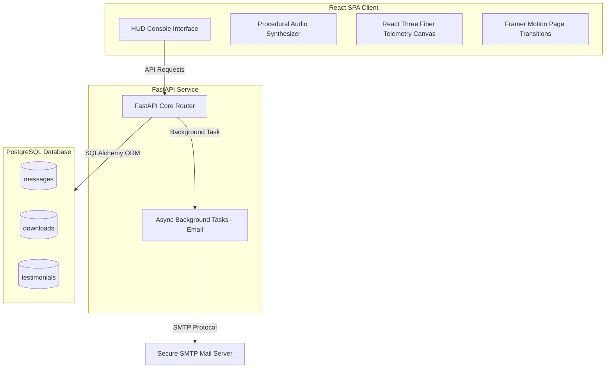

# adiDev // PROJECT AEGIS: Personnel Assessment Console

PROJECT AEGIS is a restricted-access, retro-futuristic Personnel Assessment Console and Engineer Evaluation Interface, designed to showcase the work, projects, and skills of Aditya Singh in a premium, gamified format. Visitors act as system operators, navigating through clearances, system logs, and security evaluations.

---

## System Architecture

The application is structured as a decoupled Full-Stack Web Application:
1. **Frontend**: React SPA client featuring vanilla CSS Modules, Three.js, React Three Fiber (R3F) wireframe telemetry, procedural synthesizer audio effects, and Framer Motion.
2. **Backend**: FastAPI (Python) REST API serving as a secure intelligence uplink for logging resume downloads, saving contact messages, routing email notifications asynchronously, and seeding testimonials.



---

## Technology Stack

### Frontend Core
*   **React 19 & JavaScript (ES6+)**: Core UI engine and custom stage state manager.
*   **Vite**: Frontend development server and build tool.
*   **Three.js & React Three Fiber (R3F)**: Renders a dynamic, interactive 3D wireframe telemetry globe with orbiting satellite trackers.
*   **Framer Motion**: Handles hydraulic metal security door slide transitions, spring-stamped animations, and smooth fade transitions.
*   **Vanilla CSS Modules**: Curated color palettes (carbon, graphite, electric blue, and cyan highlight tokens) utilizing customized responsive grids and cybernetic layout systems.
*   **Web Audio API**: Real-time synthesized procedural UI sounds (typewriter clicks, mechanical door sweeps, success alert chime, and thermal printer whirring) with zero audio asset downloads.

### Backend Core
*   **FastAPI (Python 3)**: High-performance, asynchronous web router API framework.
*   **SQLAlchemy ORM**: Database object-relational mapping interface.
*   **pg8000 Driver**: A pure-python PostgreSQL connection library.
*   **Pydantic v2**: Data parsing, serialization, and strict input validation.
*   **python-dotenv**: Environment configuration manager.
*   **SMTP Service**: Dispatches contact notifications asynchronously via Python standard SMTP library.

---

## Console Security Clearances (Stages 0–10)

The operator progresses sequentially through 11 security clearances synchronized with URL hash routes:

1.  **Stage 0: Boot Sequence (`""`)**
    *   Initiates a command-line terminal emulator printing loading state diagnostics, system checks, and telemetry initialization.
2.  **Stage 1: Dossier File (`#dossier`)**
    *   Displays restricted personnel details, specialized areas, and credentials for Aditya Singh.
3.  **Stage 2: Active Scanners (`#evaluation`)**
    *   Executes visual radar grid sweeps, displays interactive candidate timeline logs, and maps out engineering competencies.
4.  **Stage 3: Systems Registry (`#systems`)**
    *   Lists core programming languages and framework proficiencies. Selecting any tech item renders a custom animated SVG schematic of the corresponding micro-architecture.
5.  **Stage 4: Bureau Desk (`#cases`)**
    *   Displays retro-style Manila project folders on a structural grid. Interactive autopsies include project parameters, constraint limits, obstacle overviews, trade-offs, and success metrics.
6.  **Stage 5: Deployment Facilities (`#facilities`)**
    *   Renders industrial hardware status logs showing rotating gear cogs representing professional experience timeline details.
7.  **Stage 6: Engineering Philosophy (`#philosophy`)**
    *   Exposes critical technical trade-off documents answering architectural queries (e.g., "Why X?").
8.  **Stage 7: Live Operations (`#operations`)**
    *   Pulls real-time telemetry from active developer resources featuring simulated radars and utility matrices.
9.  **Stage 8: Field Debriefings (`#testimonials`)**
    *   Uplinks with the FastAPI server to fetch and display approved declassified testimonials from external operatives and allows submitting new field logs.
10. **Stage 9: Verdict Output (`#report`)**
    *   A mechanical thermal printer simulation rolls down the final audit verdict, printing and stamping "APPROVED" with dynamic spring mechanics. Provides the main exit CTAs: Downloading the resume, profiles, launching the email submission modal, and scheduling a meeting.
11. **Stage 10: Admin Override & Holographic Decryption Game (`#override`)**
    *   Features a biometric retinal scanner simulation (camera-based with interactive SVG fallback), system environment intrusion tracer log, and typewriter decrypted mission briefing. Operatives click the central floating holographic terminal screen inside a 3D R3F server console room to engage a Spider-Man 2-inspired 5x5 circuit board routing puzzle. Straight/curved wire cores must be rotated to establish a green energy pathway from START to END before the security timer runs out. An adaptive auditory sonar warning beacon accelerates synthesizer beeps as the countdown expires. Upon victory, displays a local operative scoreboard and opens a secure debrief feedback log upload form.

### Secret Admin Bypass Flow
At any stage prior to Stage 10, typing the secret passcode word `"override"` on the keyboard triggers a direct access gate bypass, transitioning immediately to the Stage 10 Admin verification screen where authorized administrators can input their clearance passcode to moderate pending testimonials and view the archived message transcripts.

---

## API Reference & Endpoints

All backend endpoints are prefixed with `/api/v1` and enforce strict validation.

| Method | Endpoint | Request Body | Response Type | Description |
| :--- | :--- | :--- | :--- | :--- |
| **GET** | `/health` | None | JSON | Returns the server connection state and diagnostic message. |
| **POST** | `/messages` | `MessageCreate` | `MessageResponse` | Saves contact messages in the DB and triggers a background email task to send the message details to the owner via SMTP. |
| **GET** | `/resume/download` | None | File | Logs the requesting client's IP in the DB and serves the official resume PDF file (`public/resume.pdf`). |
| **GET** | `/testimonials` | None | List[`TestimonialResponse`] | Retrieves the latest 5 declassified approved testimonials from the database. |
| **POST** | `/testimonials` | `TestimonialCreate` | `TestimonialResponse` | Inserts a new testimonial log into the database awaiting admin approval. |
| **GET** | `/admin/detect-host` | None | JSON | Returns the current server/host OS username for operative logging metadata. |
| **GET** | `/admin/messages` | None | List[`MessageResponse`] | Retrieves all saved contact messages (Admin Authorization header `X-Admin-Passcode` required). |
| **GET** | `/admin/testimonials` | None | List[`TestimonialResponse`] | Retrieves all submitted testimonials including pending ones (Admin Authorization header `X-Admin-Passcode` required). |
| **PUT** | `/testimonials/{id}/approve` | None | `TestimonialResponse` | Marks a pending testimonial as approved for public listing (Admin Authorization header `X-Admin-Passcode` required). |
| **DELETE** | `/testimonials/{id}` | None | JSON | Deletes / purges a testimonial from the database (Admin Authorization header `X-Admin-Passcode` required). |

### Data Schemas

#### Message Schema
```json
// MessageCreate
{
  "name": "string",
  "email": "user@example.com",
  "content": "string"
}
```

#### Testimonial Schema
```json
// TestimonialCreate
{
  "author": "string",
  "role": "string",
  "content": "string"
}
```

---

## Setup & Execution Guide

### Prerequisite Environment
*   **Node.js** (v18+ recommended)
*   **Python** (v3.10+ recommended)
*   **PostgreSQL** database service active

---

### 1. Backend Service Configuration

Navigate to the `backend` folder:
```bash
cd backend
```

#### Create Virtual Environment
```bash
python -m venv venv
```

#### Activate Virtual Environment
*   **Windows (PowerShell)**:
    ```powershell
    .\venv\Scripts\Activate.ps1
    ```
*   **Linux/macOS**:
    ```bash
    source venv/bin/activate
    ```

#### Install Dependencies
```bash
pip install -r requirements.txt
```

#### Environment Variables Config
Create a `.env` file in the `backend/` directory:
```env
PROJECT_NAME="adiDev"
DATABASE_URL="postgresql+pg8000://<username>:<password>@localhost:5432/<database_name>"

# SMTP Configuration (For Contact Form Notification Emails)
SMTP_HOST="smtp.gmail.com"
SMTP_PORT=587
SMTP_USER="your-email@gmail.com"
SMTP_PASSWORD="your-app-password"
SMTP_TLS=True
SMTP_FROM="your-email@gmail.com"
SMTP_TO="your-email@gmail.com"
```

#### Seed Database
Initialize tables and populate initial testimonials:
```bash
python init_db.py
```

#### Start FastAPI Server
```bash
uvicorn app.main:app --reload
```
The documentation interactive docs will be available at `http://127.0.0.1:8000/api/v1/docs`.

---

### 2. Frontend Web Client Configuration

From the root directory:

#### Install NPM Packages
```bash
npm install
```

#### Start Frontend Client
```bash
npm run dev
```
The console will launch on `http://localhost:5173`. Vite is pre-configured to proxy API requests to the backend server.

#### Create Production Bundle
```bash
npm run build
```

#### Check Source Linting
```bash
npm run lint
```
